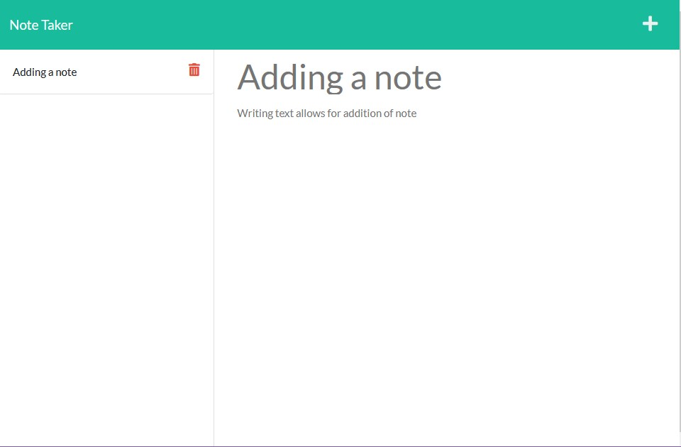

[](https://opensource.org/licenses/MIT)
# Write That Down ✍📝


## Description
Write That Down is a simple note-taking web app that allows a user to create, retrieve and delete personal notes. It utilizes HTML, CSS, Javascript and Express.JS to record and save notes. The project's front end was provided and the backend Express routing was written by me. This project exists to allow users to take notes, but also for the purpose of understanding Express.js and middleware as well. Pointing to different endpoints for different results and saving information to a makeshift "database", in this case a JSON file.

### Table of contents
- [Description](#description)
- [Installation Instructions](#installation-instructions)
- [Usage Guidelines](#usage-guidelines)
- [Contact](#contact)

## Installation Instructions
To install, download the repo ```npm install``` and run using ```npm start``` or to see it live, view Heroku site under Usage Guidelines.

## Usage Guidelines
This application works by typing in a note title, a note body and clicking the save button when it appears. Note: The save button only appears once a note body has been entered. To recall a note, click on the stored notes on the left side of the screen. The saved note will display on the main column to the right in a greyed out font. To delete a note, click the red trash can and the note will disappear. See examples from the screenshots below.

* ### Screenshots



Running Web pp


Gif demonstrating note deletion functionality. 

* ### Built Page
[Click Here For Live Page On Heroku](https://write-this-down-2819.herokuapp.com/)

## Questions? Contact me

[Find me on GitHub](https://github.com/hburnton)

[Send me an email](mailto:hburnton@gmail.com)

[Project Page on Github](https://github.com/HBurnton/WriteThatDown)

## License
This project licensed under the MIT license.
[Details on the MIT license](https://choosealicense.com/licenses/mit/)
